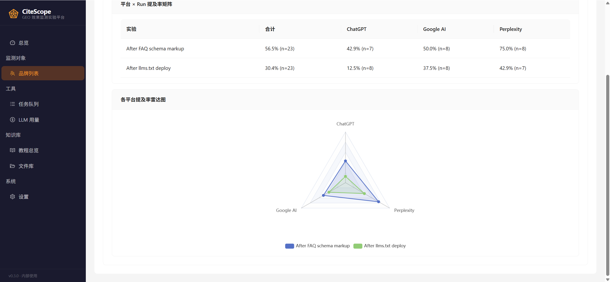
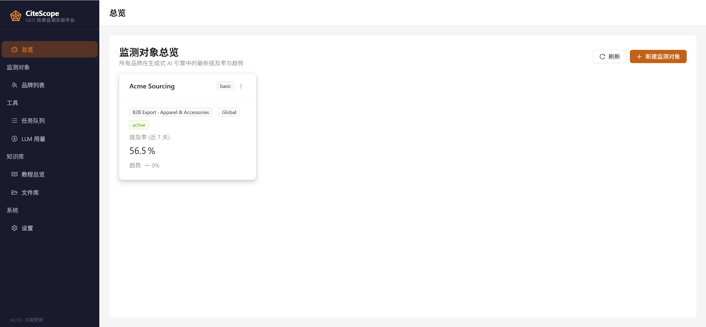
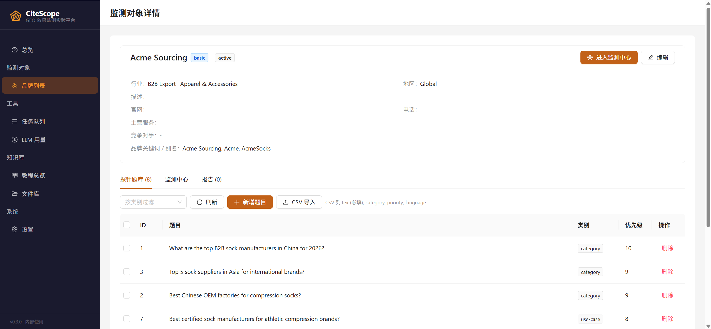
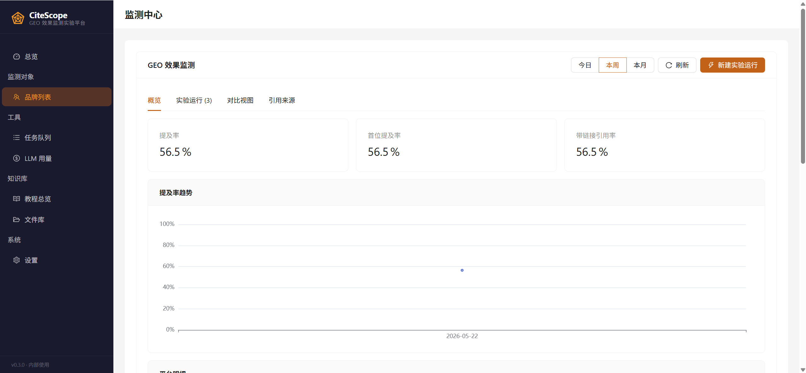
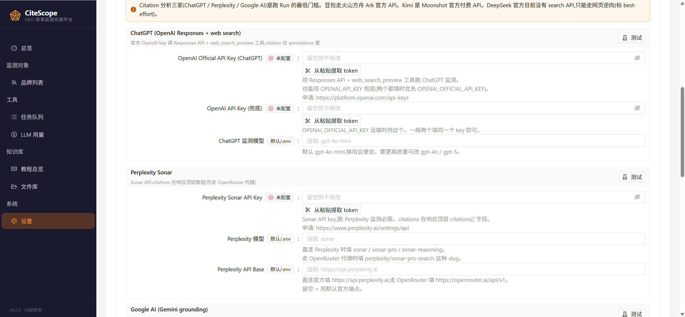
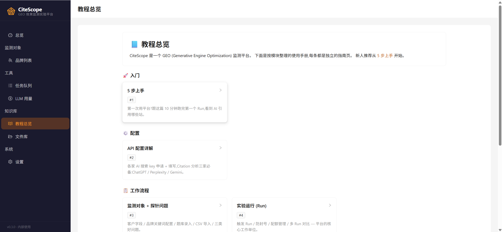
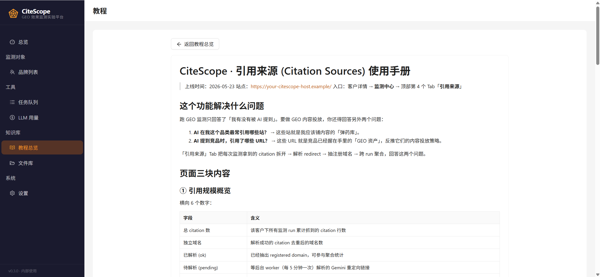
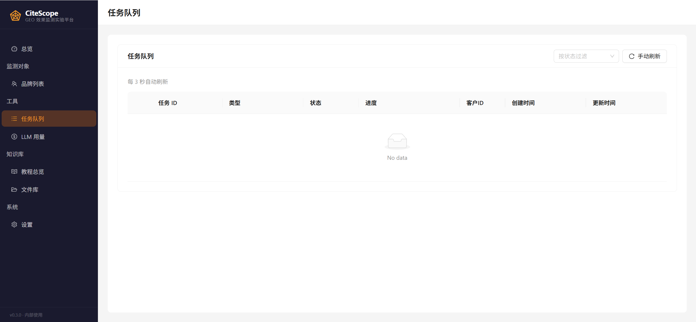
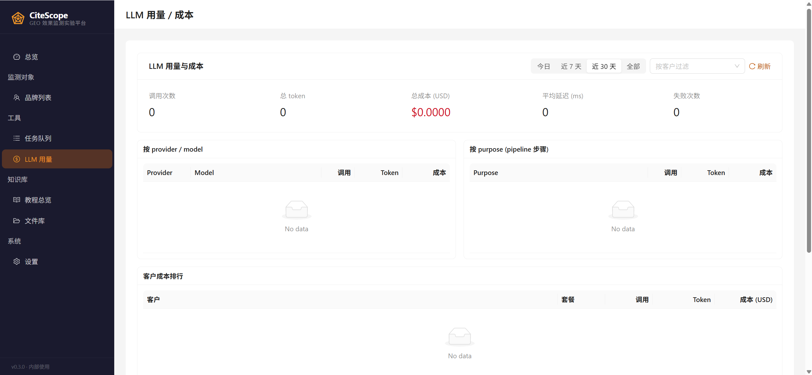

# CiteScope

> **开源 AI Citation 分析 + GEO 监测平台**
> 看清 AI 引擎在引用谁 —— 你的品牌和竞品的真实可见度。

[](./LICENSE)
[](https://github.com/<your-org>/CiteScope/actions/workflows/ci.yml)

[English →](./README.md)

---

## 这是什么

CiteScope 是一个自部署的 **GEO (Generative Engine Optimization,生成式引擎优化)** 平台。它把你的探针问题打到 ChatGPT / Perplexity / Gemini / 豆包 / Kimi / DeepSeek 这些 AI 搜索引擎上,记录回答和 AI 引用的 URL,回答三个核心问题:

1. **AI 提到你了吗?** 跨引擎、跨实验的品牌提及率
2. **AI 都引用哪些站?** 跨品类的高频引用域名 —— 这就是你应该铺内容的"弹药库"
3. **竞品的 GEO 资产是什么?** 反向归因:AI 提到竞品 X 时,引用了哪些 URL 来支撑

它是商业工具(Topify / Profound / Peec.ai)的开源平替,而且多一个独家功能:**citation-to-brand-mention 段落归因**。CiteScope 不止告诉你 `made-in-china.com` 被引用了 39 次,还告诉你这 39 次里有 7 次精确地支撑了提到你品牌的句子。

## 截图

**跨 Run 横向对比** — 差异化故事:矩阵 + 雷达图,看 `After FAQ schema markup` 这次干预把 ChatGPT/Perplexity/Gemini 三家的提及率从 30.4% 拉到 56.5%。



<details>
<summary><b>更多截图</b> — 总览 · 客户 · 监测 · 配置 · 教程 · 运维</summary>

| 页面 | 截图 |
|---|---|
| 总览 (`/clients`) |  |
| 监测对象详情 + 探针题库 |  |
| 监测中心 — 概览 Tab (KPI + 趋势) |  |
| 系统配置 — AI 搜索 API key 管理 |  |
| `/guides` 教程总览 |  |
| 单个 guide 阅读页(引用来源使用手册) |  |
| 任务队列 |  |
| LLM 用量 / 成本 |  |

</details>

## 核心功能

- **多引擎监测** —— 6 家 AI 搜索引擎统一 schema:ChatGPT (OpenAI Responses + web search)、Perplexity (Sonar / OpenRouter)、Google AI (Gemini grounding)、豆包 (火山方舟 Ark)、Kimi (Moonshot)、DeepSeek (best-effort 网页逆向)
- **Citation source 分析** —— 规范化 `monitor_citations` 表 + Top Domains + Competitor Assets 两份报表
- **URL redirect 自动解析** —— async httpx 后台 worker 把 Gemini 的 `vertexaisearch.cloud.google.com/grounding-api-redirect/*` 转成真实落地域名
- **Span 归因** —— `[citation:N]` 标记 ∩ 品牌出现句子 → 每条 citation 的 `supports_brand_mention` 字段。分句逻辑覆盖中英文 + 混排
- **实验运行 (Run)** —— 每轮监测是一个版本化的 Run。多 Run 矩阵 + 雷达图横向对比,验证 `llms.txt` / schema.org / FAQ 改造的实际效果
- **Website GEO 诊断** —— 单站点 GEO 体检:robots.txt、llms.txt、schema、AI 爬虫准入、FAQ 覆盖、内容质量。输出 0-100 分 + 改造建议
- **站内教程中心** —— 8 个模块 guide 通过 react-markdown 内嵌,`/guides` 入口
- **防封号默认值** —— 查询间随机 8-20s sleep,单平台单日 30 次硬上限,单 Run 最多 20 题

## 快速开始

### Docker Compose (1 分钟)

```bash
git clone https://github.com/<your-org>/CiteScope.git
cd CiteScope
cp backend/.env.example backend/.env
# 打开 backend/.env,至少填:
#   OPENAI_OFFICIAL_API_KEY=sk-...
#   PERPLEXITY_API_KEY=...
#   GOOGLE_AI_API_KEY=...
docker compose up -d
# 浏览器打开 http://localhost:3000
```

完成。创建一个监测对象 → 录入探针问题 → 点击「新建实验运行」。

### 手动安装

详见 [docs/INSTALL.md](./docs/INSTALL.md)(或站内 [运维指南](./frontend/src/docs/guides/operations.md))。

## 架构(30 秒版)

```
┌─────────────┐    HTTP/REST     ┌──────────────────┐
│ React + Vite│ <──────────────> │ FastAPI + uvicorn │
│  + Antd 5   │                  │  + SQLAlchemy     │
└─────────────┘                  │  + APScheduler    │
                                 └────────┬──────────┘
                                          │
                       ┌──────────────────┼──────────────────┐
                       ▼                  ▼                  ▼
                ┌────────────┐     ┌─────────────┐    ┌──────────────┐
                │ AI 引擎    │     │   SQLite    │    │ 后台 citation│
                │ 适配器 ×6  │     │  (WAL 模式) │    │ resolver job │
                └────────────┘     └─────────────┘    └──────────────┘
```

单进程 + 单 DB 文件,起步不需要 Redis / Celery / Postgres。1 vCPU / 1 GB 内存够用。

深度参考:[docs/ARCHITECTURE.md](./docs/ARCHITECTURE.md)。

## 跟商业工具对比

| | CiteScope | Topify | Profound | Peec.ai |
|---|---|---|---|---|
| **价格** | 免费(自部署) | $99-199/月 | $499+/月企业 | €80-120/月 + 附加 |
| **支持 AI 引擎** | 6 家(含豆包/Kimi/DeepSeek) | 7+ | 10+(无豆包) | 5(DS 是 €80 附加) |
| **域名聚合** | ✅ Top Domains | ✅ Source Analysis | ✅ Citations | ✅ |
| **竞品反向归因** | ✅ Competitor Assets | ✅ | ✅ | 部分 |
| **品牌-citation 段落归因** | ✅ 独家 | ❌ | ❌ | ❌ |
| **自部署** | ✅ Docker compose | ❌ 仅 SaaS | ❌ 仅 SaaS | ❌ 仅 SaaS |
| **Prompt 数量** | 不限 | 100 (Basic) / 250 (Pro) | 按报价 | 按档位 |
| **源码** | MIT 全开源 | 闭源 | 闭源 | 闭源 |

完整对比:[docs/COMPARISON.md](./docs/COMPARISON.md)。

## 路线图

- [ ] Postgres 后端(目前仅 SQLite)
- [ ] 更多 AI 适配器:Bing Copilot、Claude.ai、You.com、Brave Search
- [ ] 按地区监测(OpenAI 的 user_location、Perplexity 的 ccTLD)
- [ ] 内置告警(Slack / Webhook)— 提及率下滑触发
- [ ] 多租户(每客户独立 API key 隔离)
- [ ] 公开只读报表 URL(给客户分享用)

需要哪个,提 issue 或 PR 来。

## 文档

- [5 步上手](./frontend/src/docs/guides/getting-started.md) — 新人 10 分钟跑通
- [API 配置详解](./frontend/src/docs/guides/settings.md) — 各家 key 申请 + endpoint
- [引用来源](./frontend/src/docs/guides/citation-sources.md) — 核心功能用法
- [架构](./docs/ARCHITECTURE.md) — 内部技术细节
- [对比](./docs/COMPARISON.md) — 跟商业工具的逐项对比
- [贡献指南](./CONTRIBUTING.md) — PR 流程 + 公开 issue

## 状态

当前生产用于一家 B2B 出口业务的英文 AI 搜索引擎 GEO 监测。开源发布日期:**2026-05-23**。

## License

[MIT](./LICENSE) — 拿去用,改商用都行。

## 致谢

CiteScope 借鉴了商业 GEO 平台(Topify、Profound、Peec.ai)以及围绕 AI 搜索优化的 OSS 社区。基于 FastAPI、Antd、react-markdown、tldextract、httpx、APScheduler 构建。
